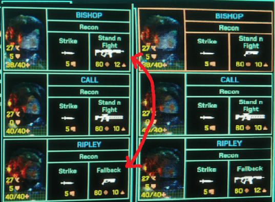
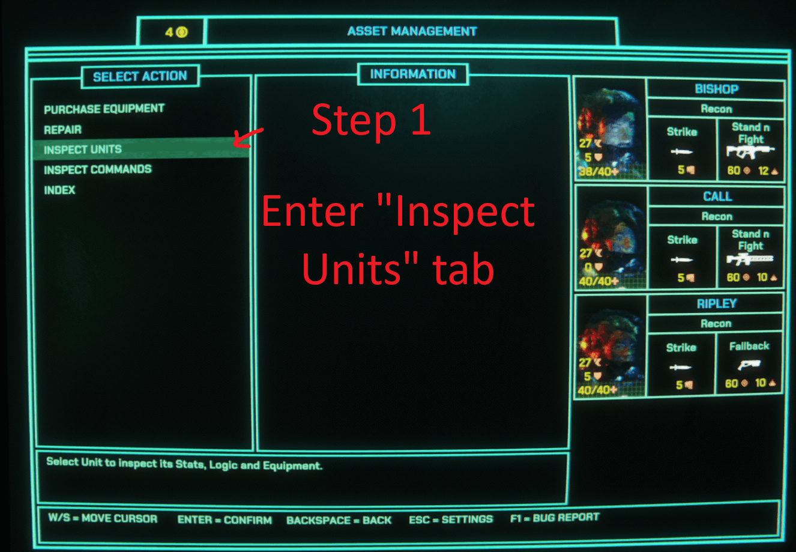
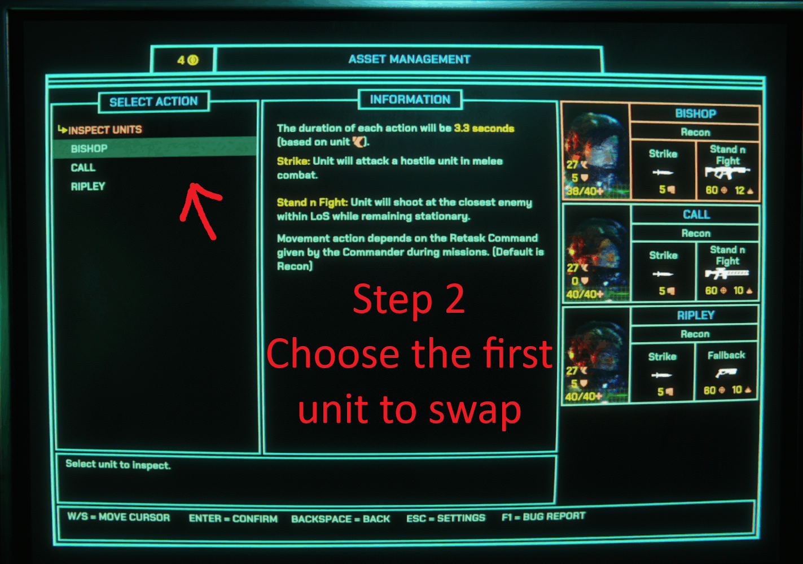
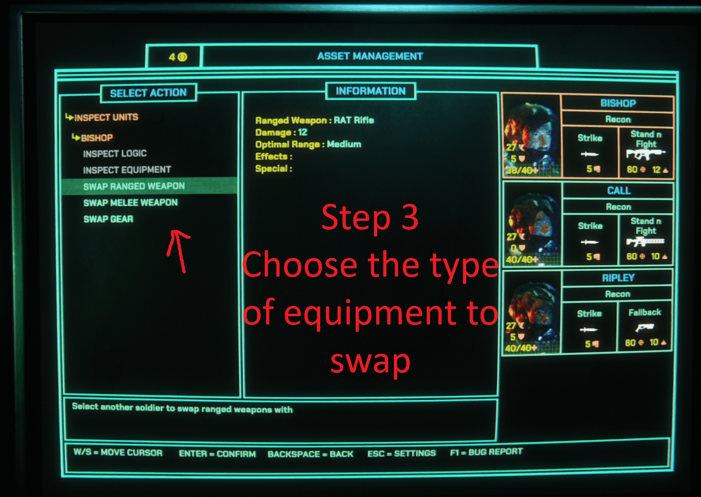
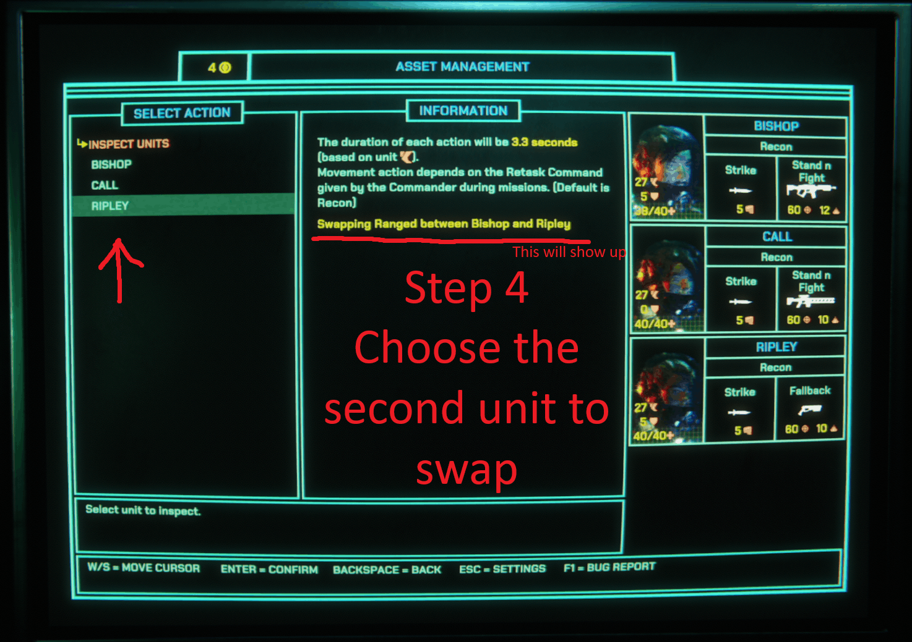
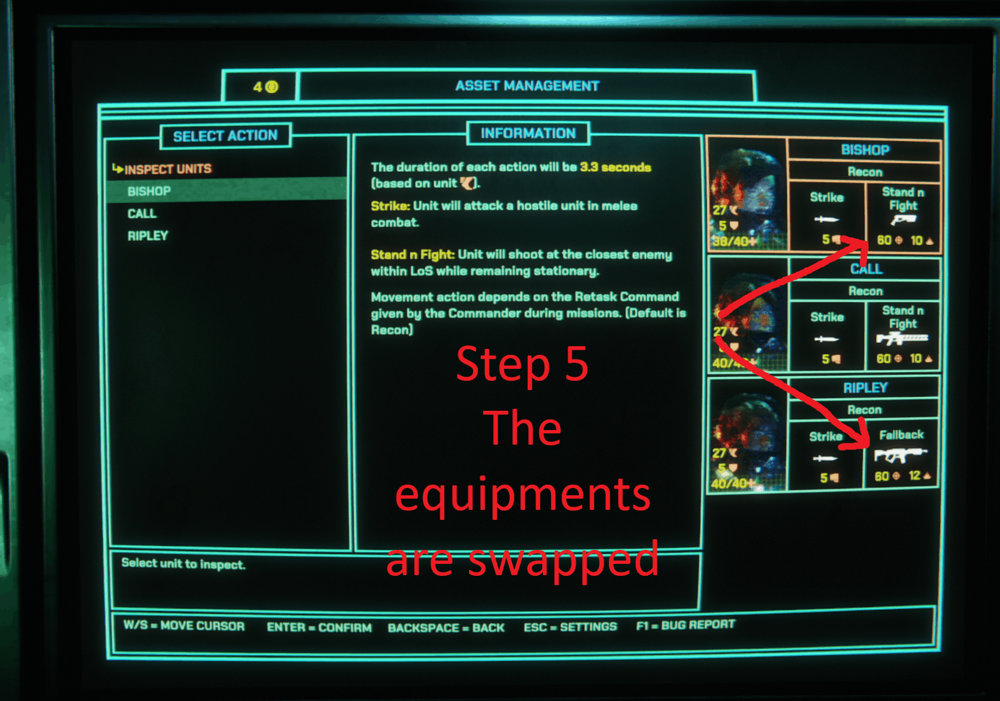

# XenopurgeManageEquipment

Swap weapons between your units because it makes sense.

A MelonLoader mod for Xenopurge.

Source code is available on [GitHub](https://github.com/bottledwhisky/XenopurgeManageEquipment).

## Features

- Swap weapons between your units under the squad inspection tab.

## Requirements

- [MelonLoader](https://melonloader.co/)

## Installation

Skip to step 2 if you already have MelonLoader installed.

1. Install MelonLoader
    a. `<game_directory>` is the directory where the game executable is located. For example, `C:\Program Files (x86)\Steam\steamapps\common\Xenopurge`. If you still cannot find it, right-click the game in your Steam library, select "Manage", then "Browse local files".
2. Place the mod DLL in `<game_directory>/Mods/`
3. Restart the game

## Usage

1. In the Asset Management tab (default hotkey: backspace), or in any shops, select "Inspect Units".
2. Select a unit and click the "Swap XXX" button.
3. Select another unit to swap weapons with.
4. Confirm the swap.

## Notes

- Mac users: MelonLoader only supports Windows and Linux. Wait for Steam Workshop support.
- Xenopurge uses Mono, not IL2CPP.
